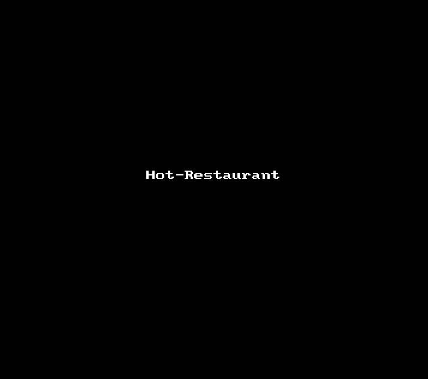

# Hot Restaurant
This project lets the user create a reservation in a restaurant and see the list of reservations already in place.
## Demo

## Features
- The user can reserve a table by filling a simple form.
- There is a list of reservations already done.
- It is very simple to use.
- Every restaurant should have this app!
## GitHub Repository
[https://github.com/giannifontanot/hot-restaurant/](https://github.com/giannifontanot/hot-restaurant/)
## Live Link
This project runs with NodeJS. At this time there no live link of this project.
## Support
If you need help with this project, please write to: [giannifontanot@gmail.com](giannifontanot@gmail.com)
## Authors
 - [@giannifontanot](https://www.github.com/giannifontanot)
## 🔗 Links

